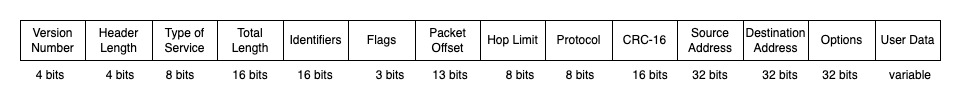

- Data at Network layer is referred as Packets.
- The main aim of the Network L ayer the source-to- destination delivery of a packet across multiple networks (links).
- Data link Layer moves frames from one end to the other end of the wire but Network layer deals with end-to-end transmission.
- End-to-End transmission may require making many hops at intermediate routers along the way.
- If two systems are attached to the same network, there is usually no need for a network layer.
- Network layer deals with things like:
	- Knowing about the topology of the network
	- Choosing appropriate paths to avoid overloading some of the communication lines.

## Functions of Network Layer

| Layer Name | Functions | Devices | Protocols |
| --- | --- | --- | --- |
| Network Layer | 1. Logical Addressing  2. Routing  3. Fragmentation | 1. Layer-2 Switch  2. Router  3. Brouters | 1. IP  2. ICMP |

**1. Logical Addressing:**
-  IP addressing is handled by the network layer.
-  The logical address (IP) of both sender and receiver is added as the header of the packet by network layer.

**2. Routing:**
- Routing is the process of path selection in any network.
- Any Data or Information that needs to be transmitted from source to destination need to be routed through many nodes and links that connect to those endpoints.

**3. Fragmentation & Reassembly:**
- Network layer breaks down the data into individual units called fragments which it sends down to the data link layer after adding the header.
- The data is fragmented at Network Layer because several Data Link Layer technologies have limits on the length of any messagethat can be transmitted.

## Virtual circuits and Datagram Subnets

### Virtual circuits
- The route needs to be setup prior to data transmission between the intermediate nodes.
- All the packets transmitted during the session between the two ends using the predetermied circuit.
- An entry is registered in each intermediate nodes to indicate the route for the connection that has been set up.
- As packets passed through predetermined route, packets can have short headers, containing only a virtual circuit identifier (VCI), and may not contain the destination as each intermediate node passes the packets according to the information that was stored in it, in the setup phase.
- In this way, packets arrive at the destination in the correct sequence, and it is guaranteed that essentially there will not be errors.
- This approach is slower than Circuit Switching, since different virtual circuits may compete over the same resources, and an initial setup phase is needed to initiate the circuit. 
- Problem:
	- Like for any Circuit Switching technique - if an intermediate node fails, all virtual circuits that pass through it are lost.
- E.g: X.25 and Frame Relay
- Commonly used for public data networks (PDN).

### Datagram Subnets
- Each packet is treated as an independent entity, and its header contains full information about the destination of the packet.
- The intermediate nodes checks the header of the packet, and decide to which node to send the packet so that it will reach its destination.
- Packets can follow different routes to the destination, and delivery is not guaranteed.
- The packets can reach the destination in a different order than they were sent, thus they must be sorted at the destination to form the original message.
- This approach is time consuming since every router has to decide where to send each packet.
- Implementation: implementation of Datagram Switching network
- Used in Internet.

### Differences between virtual and datagram packet switching

| S.No. | Datagram network | Virtual-circuit network |
| --- | --- | --- |
| 1. | Circuit setup is not required. | Circuit setup is required. |
| 2. | Each packet contains the full source and destination address | Each packet contains a short VC number |
| 3. | Routers do not hold state information about connections | Each Virtual Circuit requires router table space per connection |
| 4. | Each packet is routed independently | Route chosen when Virtual Circuit is set up; all packets follow it |
| 5. | None, except for packets lost during the crash | All Virtual Circuits that passed through the failed router are terminated | 

## IPv4 Addresses

### IP
- It is network layer protocol and performs addressing and routing
- It is used at each of the nodes through which the message passes travels.
- Perform routing of message from source to destination.
- Involved only when data comes from or goes to the application layer.
- Two forms of IP: IPv4  and IPv6.

### IPv4 Address Space
- Address space is the total number of addresses used by the protocol.
- An IPv4 address is 32 bits long grouped into one byte in each group (W.X.Y.Z). This 1 byte field is called octet.
- IPv4 addresses are unique in same network at the same time.
- IPv4 addresses must be universal i.e. the addressing system must be accepted by any device that wants to be connected to a Computer Network.
- Has 192-bit header
- Header contains fields like source and destination addresses, packet length, and packet number.
- Older than IPv6 but most widely used in recent times.
- A total of 4.2 billion addresses are available among which 500 million address are reserved.
- Reserved Addresses [Full list here](https://en.wikipedia.org/wiki/Reserved_IP_addresses) - Just for self study

### Notations
- Pattern in which IP address is written.
- 2 types of Notations: Binary & Dotted-Decimal Notation.

**1. Binary Notation:**
	- the IPv4 address is displayed as 32 bits.
	- Each octet is often referred to as a byte
	- Eg: `01110101 10010101 00011101 00000010`

**2. Dotted-Decimal Notation:**
	- Makes IPv4 addressing more compact and easier to read.
	- Usually written in decimal form with a decimal point (dot) separating the bytes
	- Each decimel number in an octect of dotted-decimal notation is a value ranging from 0 to 255.
	- Eg: `10.20.29.2`

